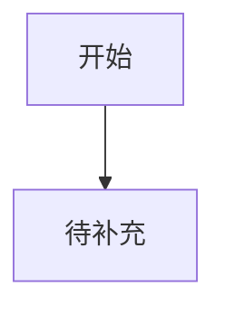

# {{PRODUCT_NAME}} 界面与体验设计文档

## 上游前置审查

- 需求文档是否清晰：
- 技术架构是否清晰：
- 待确认问题：

## 设计方向候选

| 方向 | 主题资产 | 视觉气质 | 适合理由 | 预览路径 |
|---|---|---|---|---|
| 方案 A | 待补充 | 待补充 | 待补充 | 待补充 |
| 方案 B | 待补充 | 待补充 | 待补充 | 待补充 |
| 方案 C | 待补充 | 待补充 | 待补充 | 待补充 |

## 已选方向

- 选择：
- 选择原因：
- 不采用方向：

## 页面清单

| 页面 | 原型路径 | 入口来源 | 覆盖功能编号 | 页面目标 |
|---|---|---|---|---|
| 首页/入口 | prototype/index.html | 直接打开 | M1-F1 | 待补充 |

## 核心页面布局

### prototype/index.html

- 页面目标：
- 区块结构：
- 复用布局：
- 核心元素：
- 交互逻辑：
- 状态设计：

## 复用布局清单

| 布局 | 路径 | 适用页面 | 结构职责 | 可复用规则 |
|---|---|---|---|---|
| 待补充 | prototype/layout/待补充.html | 待补充 | 待补充 | 待补充 |

## 需求到界面映射

| 功能编号 | 页面/路径 | 控件/组件 | 用户动作 | 状态覆盖 | 原型路径 |
|---|---|---|---|---|---|
| M1-F1 | 待补充 | 待补充 | 待补充 | 成功/失败/空/加载 | prototype/index.html |

## 组件清单

| 组件 | 使用位置 | 状态 | 行为 |
|---|---|---|---|
| 待补充 | 待补充 | 默认/悬停/禁用/加载/错误 | 待补充 |

## 用户流程



## 原型结构

```text
prototype/
  index.html
  pages/
  layout/
  components/
  assets/
```

| 路径 | 职责 | 产物要求 |
|---|---|---|
| `prototype/index.html` | 原型入口、全局导航、关键流程起点 | 必须能进入所有 P0 原型路径；多页面系统必须链接到 `pages/` 中的具体页面。 |
| `prototype/pages/` | 独立业务页面 | 多页面系统的每个主要页面单独存放；页面结构必须引用或遵循 `layout/` 中的复用布局。 |
| `prototype/layout/` | 可复用页面结构 | 沉淀应用外壳、导航、页头、侧栏、内容网格、表单页骨架、状态页骨架等结构，保证后续开发能稳定复现。 |
| `prototype/components/` | 可复用界面组件和交互片段 | 存放按钮组、表单控件、卡片、列表、弹窗、状态块等组件示例，并标注使用场景和状态。 |
| `prototype/assets/` | 公共资源 | 存放样式、脚本、图片、图标、示例数据等资源；页面不得依赖散落在目录外的资源。 |

页面原型必须优先复用 `prototype/layout/` 的结构，不要只在单个页面里临时拼装。

## 质量检查记录

- 已修正：
- 未采纳：
