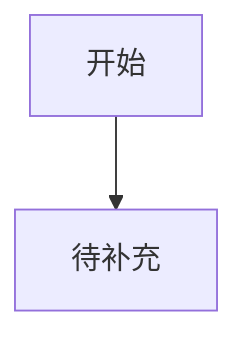

# 未命名产品 界面与体验设计文档

## 上游前置审查

- 需求文档是否清晰：
- 技术架构是否清晰：
- 高频真实需求是否清晰：
- 真实使用流程是否清晰：
- 待确认问题：

## 上游同步记录

- 本阶段是否改变页面清单、交互路径、字段、状态、技术约束或验收标准：
- 已同步回写的上游文档：
- `workflow-state.json` notes 记录：

## UI 硬规则

- 页面可见文案、按钮、导航、空状态和提示语禁止使用 emoji。
- 图标必须使用图标库、SVG 或图片资源，不用 emoji 代替。
- 正文、表单、按钮、列表文本默认不小于 16px。
- 辅助说明可小于 16px，但不得低于 14px；移动端优先保持 16px 起。

## 设计方向候选

| 方向 | 主题资产 | 视觉气质 | 适合理由 | 预览路径 |
|---|---|---|---|---|
| 方案 A | 待补充 | 待补充 | 待补充 | 待补充 |
| 方案 B | 待补充 | 待补充 | 待补充 | 待补充 |
| 方案 C | 待补充 | 待补充 | 待补充 | 待补充 |

## 首页 Demo 预览

| 方向 | Demo 路径 | 展示重点 | 是否可打开 |
|---|---|---|---|
| 方案 A | prototype/directions/option-a.html | 首屏、核心入口、关键状态、视觉气质 | 待确认 |
| 方案 B | prototype/directions/option-b.html | 首屏、核心入口、关键状态、视觉气质 | 待确认 |
| 方案 C | prototype/directions/option-c.html | 首屏、核心入口、关键状态、视觉气质 | 待确认 |

预览索引：`prototype/directions/index.html`

## 已选方向

- 选择：
- 选择原因：
- 不采用方向：

## 页面清单

| 页面 | 原型路径 | 入口来源 | 覆盖功能编号 | 对应高频流程步骤 | 页面目标 |
|---|---|---|---|---|---|
| 首页/入口 | prototype/index.html | 直接打开 | M1-F1 | 待补充 | 待补充 |

## 页面访问逻辑

| 高频流程步骤 | 用户动作 | 页面/模块 | 入口 | 下一步 | 减少跳转/理解成本的设计 |
|---|---|---|---|---|---|
| 待补充 | 待补充 | 待补充 | 待补充 | 待补充 | 待补充 |

## 核心页面布局

### prototype/index.html

- 页面目标：
- 区块结构：
- 复用布局：
- 核心元素：
- 交互逻辑：
- 状态设计：

## 复用布局清单

| 布局 | 路径 | 适用页面 | 结构职责 | 可复用规则 |
|---|---|---|---|---|
| 待补充 | prototype/layout/待补充.html | 待补充 | 待补充 | 待补充 |

## 模块整合与减负记录

| 原候选页面/模块 | 整合后位置 | 整合原因 | 对用户成本的影响 |
|---|---|---|---|
| 待补充 | 待补充 | 避免页面堆叠、重复入口或低频能力前置 | 待补充 |

## 需求到界面映射

| 功能编号 | 页面/路径 | 控件/组件 | 用户动作 | 高频流程位置 | 状态覆盖 | 原型路径 |
|---|---|---|---|---|---|---|
| M1-F1 | 待补充 | 待补充 | 待补充 | 待补充 | 成功/失败/空/加载 | prototype/index.html |

## 组件清单

| 组件 | 使用位置 | 状态 | 行为 |
|---|---|---|---|
| 待补充 | 待补充 | 默认/悬停/禁用/加载/错误 | 待补充 |

## 用户流程



## 原型结构

```text
prototype/
  directions/
  index.html
  pages/
  layout/
  components/
  assets/
```

| 路径 | 职责 | 产物要求 |
|---|---|---|
| `prototype/directions/` | 设计方向首页 demo | 每个候选方向必须有一个可打开的首页 demo；`index.html` 汇总 2-3 个预览入口，供用户选择方向。 |
| `prototype/index.html` | 原型入口、全局导航、关键流程起点 | 必须能进入所有 P0 原型路径；多页面系统必须链接到 `pages/` 中的具体页面。 |
| `prototype/pages/` | 独立业务页面 | 多页面系统的每个主要页面单独存放；页面结构必须引用或遵循 `layout/` 中的复用布局。 |
| `prototype/layout/` | 可复用页面结构 | 沉淀应用外壳、导航、页头、侧栏、内容网格、表单页骨架、状态页骨架等结构，保证后续开发能稳定复现。 |
| `prototype/components/` | 可复用界面组件和交互片段 | 存放按钮组、表单控件、卡片、列表、弹窗、状态块等组件示例，并标注使用场景和状态。 |
| `prototype/assets/` | 公共资源 | 存放样式、脚本、图片、图标、示例数据等资源；页面不得依赖散落在目录外的资源。 |

页面原型必须优先复用 `prototype/layout/` 的结构，不要只在单个页面里临时拼装。

## 质量检查记录

- 已修正：
- 未采纳：

## 原型自审

- 自审报告：`docs/prototype-review.md`
- 截图目录：`prototype/review/screenshots/`
- Impeccable 上下文：Codex 使用 `.agents/context/PRODUCT.md`, `.agents/context/DESIGN.md`；Claude Code 使用 `.claude/context/PRODUCT.md`, `.claude/context/DESIGN.md` 或沿用 `.agents/context/`

| 审查项 | 要求 | 状态 |
|---|---|---|
| Playwright 截图 | 候选 demo 和完整原型页面覆盖 desktop/tablet/mobile | 待确认 |
| Impeccable critique | 审美、视觉层级、信息架构、AI 味、认知负荷 | 待确认 |
| Impeccable audit | 可访问性、性能、响应式、语义结构、反模式 | 待确认 |
| Impeccable adapt | 桌面、平板、移动适配 | 待确认 |
| Impeccable polish | 最终综合打磨 | 待确认 |
