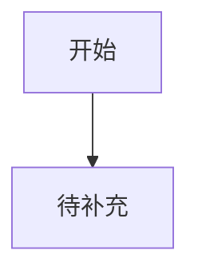

# {{PRODUCT_NAME}} 界面与体验设计文档

## 阶段产物索引

| 阶段 | 产物 | 状态 | 用户确认 |
|---|---|---|---|
| 设计简报 | `docs/ui-design-brief.md` | 待补充 | 待确认 |
| 蓝图(信息架构/流程/页面/功能/交互) | `docs/feature-flow-layout.md` | 待补充(上游) | 待确认 |
| 设计系统和 tokens | `docs/ui-design-tokens.md` | 待补充 | 待确认 |
| UI 构建任务 | `docs/ui-build-tasks.md` | 待补充 | 待确认 |
| 方向 demo | `prototype/directions/index.html` | 待补充 | 待确认 |
| 完整原型 | `prototype/index.html` | 待补充 | 待确认 |
| 原型自审 | `docs/prototype-review.md` | 待补充 | 待确认 |

## 上游前置审查

- 蓝图(`docs/feature-flow-layout.md`)五层是否定稿:
- project-config 是否清晰:
- 是否已询问用户上下文是否足够理解显性需求和隐藏需求:
- 待确认问题:

## 设计简报摘要

- 设计简报：`docs/ui-design-brief.md`
- 主用户：
- 使用触发：
- 高频任务：
- 成功体验：
- 审美方向：
- 反向参考：
- 不做范围：

## 信息架构来源(蓝图)

- 蓝图来源:`docs/feature-flow-layout.md` 第 1 层(信息架构)、第 2 层(核心流程)、第 3 层(逐个页面骨架)
- 核心页面数量:
- 主导航模型:
- 用户 80% 时间所在页面:
- 关键入口和退出路径:
- 页面边界确认状态(若需调整,按 craft-principles 重大变革协议回 blueprint):

## 设计系统与 Tokens 摘要

- Tokens 文档：`docs/ui-design-tokens.md`
- UI 框架/组件库：
- 字体：
- 图标：
- 色彩策略：
- 间距和密度：
- 响应式断点：
- 主题库 README：
- 已读取主题 `DESIGN.md`：
- Vben 主色值：
- Vben 使用范围：仅主色/品牌色 token，不作为组件规范
- Arco Design Pro Vue / Arco Design Vue 一比一引用状态：
- 项目主色色阶是否已覆盖 Arco primary token：
- 组件级 token 应用表：`docs/ui-design-tokens.md#组件级-token-应用表`
- B 端规范采用状态：

## UI 硬规则

- 页面可见文案、按钮、导航、空状态和提示语禁止使用 emoji。
- 图标必须使用图标库、SVG 或图片资源，不用 emoji 代替。
- 通用 Web 和移动端正文、表单、按钮、列表文本默认不小于 16px。
- B 端网页、后台、运营台、管理系统和 SaaS 产品优先遵循 B 端设计规范的文字、间距和控件参数，不强行套用移动端 16px 起规则。
- B 端项目必须先统一主色、字号、间距、圆角、阴影和组件控件 token，再实现页面；所有组件样式以 `docs/ui-design-tokens.md` 的组件级 token 应用表为准。
- Progress 进度条固定使用项目主色 `--primary-6/#4F63D7` 和 Arco 轨道色 `var(--color-fill-3)`；不得按百分比变化为绿/橙/红。
- 禁止页面级临时样式：不得为单个页面或组件临时写主色、hover 色、active 色、圆角、阴影、控件高度或表格密度；需要新增时先回写 `docs/ui-design-tokens.md`。

## B 端规范引用记录

- 是否识别为 B 端网页：
- 判断依据：
- 是否读取 `assets/design-themes/vben/DESIGN.md` 提取主色：
- Vben 主色值：
- Arco Design Pro Vue / Arco Design Vue 组件、布局和交互一比一引用策略：
- 不采用 Vben 主色或 Arco Design Pro 组件的原因：
- 章节索引检查：`rg -n "^##|^###" references/b-end-ui-design-spec.md`
- 本阶段已按需读取的规范章节：
- 已落入原型的规则：
- 未采用或偏离规范的原因：

| 阶段门禁 | 已引用章节 | 采用规则 | 对应设计动作 | 状态 |
|---|---|---|---|---|
| 识别和边界 | `使用原则` | 待补充 | 判断是否默认应用 B 端规范，记录偏离原因 | 待确认 |
| 风格和配色 | `配色流程与色彩系统规则` | 待补充 | 先明确品牌调性和产品风格，再做灰度和色彩 token | 待确认 |
| 画布和密度 | `画布与适配`、`页面基础参数`、`栅格与间距`、`B 端适配与响应式规则` | 待补充 | 按 `1440x900` 设计并校验 `1280x800` 核心内容 | 待确认 |
| 页面清单和信息架构 | `格式塔设计原则`、`视觉动线与页面布局模型规则` | 待补充 | 按页面类型选择动线，组织分组、对齐和重复结构 | 待确认 |
| 页面模式和布局骨架 | `基础组件体系与布局参数规则`、`后台数据页面补充规则` | 待补充 | 确定页面模式、固定区、自适应区、表格和筛选骨架 | 待确认 |
| 组件和视觉表现 | `文本参数`、`图标参数`、`按钮参数`、`输入框参数`、`视觉层级与组件表现规则`、`后台界面质感细节规则` | 待补充 | 收敛字号、间距、控件高度、层级和质感细节 | 待确认 |
| 交互流程和状态 | `交互效率与认知负荷规则`、`尼尔森可用性原则补充规则`、`包容性与可理解性补充规则` | 待补充 | 补齐反馈、防错、错误修正、权限异常、加载超时和帮助入口 | 待确认 |
| 原型自审和修正 | 问题对应章节的 `禁止事项` 和 `验收标准` | 待补充 | 根据截图问题反查规范并修正 | 待确认 |

## 组件级 Token 锁定记录

本节汇总 `docs/ui-design-tokens.md` 的组件级 token 应用结果。完整原型和开发实现必须逐项复用，不得只写“使用 Arco”。

| 组件 | 字号/高度 | 颜色 token | 圆角 token | 阴影/边框 token | 间距 token | 原型使用位置 | 是否一致 |
|---|---|---|---|---|---|---|---|
| Button | 待补充 | `--primary-6` / Arco semantic | `@btn-border-radius` | `@btn-border-width` | padding token | 待补充 | 待确认 |
| Input / Textarea | 待补充 | focus `--primary-6` | `@input-border-radius` | focus shadow token | padding token | 待补充 | 待确认 |
| Select / Cascader / TreeSelect | 待补充 | hover / active token | popup radius | popup border | option padding | 待补充 | 待确认 |
| Table | 待补充 | header / row hover token | `@table-border-radius` | table border token | cell padding token | 待补充 | 待确认 |
| Form | 待补充 | label text token | - | - | item margin token | 待补充 | 待确认 |
| Modal / Drawer | 待补充 | text / mask token | modal/drawer radius | popup shadow | padding token | 待补充 | 待确认 |
| Card | 待补充 | bg / title token | `@card-border-radius` | card border token | body padding token | 待补充 | 待确认 |
| Tag / Badge | 待补充 | semantic / neutral token | tag radius | - | padding token | 待补充 | 待确认 |
| Tabs / Pagination / Menu | 待补充 | active `--primary-6` | item radius | - | item spacing | 待补充 | 待确认 |
| Progress | 字号 `12px` | inner `--primary-6/#4F63D7`，track `var(--color-fill-3)` | line/circle 按 Arco | - | 按 Arco | 待补充 | 待确认 |
| Tooltip / Popover / Dropdown | 待补充 | popup token | popup/dropdown radius | `@popup-shadow` | option height / padding | 待补充 | 待确认 |
| Skeleton / Spin / Empty / Result | 待补充 | Spin `--primary-6`，Skeleton fill token | 按 Arco | - | 按 Arco | 待补充 | 待确认 |

## 禁止临时样式检查

| 检查项 | 结果 | 证据 |
|---|---|---|
| 是否存在页面级硬编码主色、hover 色、active 色 | 待确认 | 待补充 |
| 是否存在不同页面按钮高度/圆角不一致 | 待确认 | 待补充 |
| 是否存在输入、选择、表格、弹窗控件尺寸不一致 | 待确认 | 待补充 |
| 是否存在 Progress 按百分比变色 | 待确认 | 待补充 |
| 是否存在自定义阴影覆盖 Arco popup/card shadow | 待确认 | 待补充 |

## 主题库扫描和设计方向候选

- 主题库路径：
- 主题库 README：
- 主题扫描命令：
- 已读取主题 `DESIGN.md`：
- 已读取主题 `examples.html`：
- B 端是否默认采用 Arco Design Pro + Vben 主色：

| 方向 | 主题 `DESIGN.md` | 主色来源 | 组件框架/组件语义 | 视觉气质 | 适合理由 | 预览路径 |
|---|---|---|---|---|---|---|
| 方案 A | assets/design-themes/vben/DESIGN.md | Vben 主色 | Arco Design Pro Vue / Arco Design Vue 一比一引用 | 待补充 | B 端默认推荐 | 待补充 |
| 方案 B | 待补充 | 待补充 | 待补充 | 待补充 | 待补充 |
| 方案 C | 待补充 | 待补充 | 待补充 | 待补充 | 待补充 |

## 首页 Demo 预览

| 方向 | Demo 路径 | 展示重点 | 是否可打开 |
|---|---|---|---|
| 方案 A | prototype/directions/option-a.html | 首屏、核心入口、关键状态、视觉气质 | 待确认 |
| 方案 B | prototype/directions/option-b.html | 首屏、核心入口、关键状态、视觉气质 | 待确认 |
| 方案 C | prototype/directions/option-c.html | 首屏、核心入口、关键状态、视觉气质 | 待确认 |

预览索引：`prototype/directions/index.html`

## 已选方向

- 选择：
- 选择原因：
- 不采用方向：

## 页面清单

| 页面 | 原型路径 | 入口来源 | 覆盖功能编号 | 对应高频流程步骤 | 页面目标 |
|---|---|---|---|---|---|
| 首页/入口 | prototype/index.html | 直接打开 | M1-F1 | 待补充 | 待补充 |

## 页面访问逻辑

| 高频流程步骤 | 用户动作 | 页面/模块 | 入口 | 下一步 | 减少跳转/理解成本的设计 |
|---|---|---|---|---|---|
| 待补充 | 待补充 | 待补充 | 待补充 | 待补充 | 待补充 |

## 页面任务卡

在正式编写完整业务页面原型代码前，必须把本节内容提交给用户确认。每个页面只定义一个最核心的用户任务，先想清用户为什么来、要操作什么、哪些内容不属于本页。

| 页面 | 入口来源 | 用户进入原因 | 当前上下文对象 | 页面核心任务 | 用户操作流程 | 主操作 | 辅助模块 | 本页不做什么 | 跳转边界和上下文边界 |
|---|---|---|---|---|---|---|---|---|---|
| 首页/入口 | 直接打开 | 待补充 | 待补充 | 待补充 | 待补充 | 待补充 | 待补充 | 待补充 | 待补充 |

## 模块准入表

模块必须直接服务页面核心任务，不能因为“可能有用”就放进当前页。低频、审计、全局配置、跨上下文审核等能力应删除、折叠或后置到更合适页面。

| 页面 | 模块 | 服务的页面核心任务 | 模块类型 | 保留/折叠/后置/删除 | 原因 |
|---|---|---|---|---|---|
| 首页/入口 | 待补充 | 待补充 | 主流程/辅助判断/低频信息/跨上下文能力 | 待补充 | 待补充 |

## 原型开发前确认

- 确认状态：待确认
- 状态取值：只能是 `待确认` / `需修正` / `已确认`
- 确认时间：
- 用户意见：
- 修正记录：
- 门禁要求：未确认不得进入原型实现。
- 同步文档:确认或修正后必须按 craft-principles 重大变革协议处理 — 影响蓝图的回写 `docs/feature-flow-layout.md` 对应层,影响构建任务的同步 `docs/ui-build-tasks.md`,本文件作汇总。

| 确认项 | 内容摘要 | 状态 |
|---|---|---|
| 页面任务卡 | 每个页面的入口来源、用户进入原因、当前上下文对象、页面核心任务、用户操作流程、主操作、辅助模块、本页不做什么、跳转边界和上下文边界已明确 | 待确认 |
| 模块准入表 | 每个模块的保留、折叠、后置或删除理由已明确 | 待确认 |
| 页面边界 | 不把配置、审核、报表、审计等无关能力塞进不匹配页面 | 待确认 |
| 修正闭环 | 用户指出的边界问题已回写本设计文档并重新确认 | 待确认 |

## 核心页面布局

### prototype/index.html

- 页面目标：
- 区块结构：
- 复用布局：
- 核心元素：
- 交互逻辑：
- 状态设计：

## 复用布局清单

| 布局 | 路径 | 适用页面 | 结构职责 | 可复用规则 |
|---|---|---|---|---|
| 待补充 | prototype/layout/待补充.html | 待补充 | 待补充 | 待补充 |

## 模块整合与减负记录

| 原候选页面/模块 | 整合后位置 | 整合原因 | 对用户成本的影响 |
|---|---|---|---|
| 待补充 | 待补充 | 避免页面堆叠、重复入口或低频能力前置 | 待补充 |

## 需求到界面映射

| 功能编号 | 页面/路径 | 控件/组件 | 用户动作 | 高频流程位置 | 状态覆盖 | 原型路径 |
|---|---|---|---|---|---|---|
| M1-F1 | 待补充 | 待补充 | 待补充 | 待补充 | 成功/失败/空/加载 | prototype/index.html |

## 组件清单

| 组件 | 使用位置 | 状态 | 行为 |
|---|---|---|---|
| 待补充 | 待补充 | 默认/悬停/禁用/加载/错误 | 待补充 |

## 用户流程



## 原型结构

```text
prototype/
  directions/
  index.html
  pages/
  layout/
  components/
  assets/
```

| 路径 | 职责 | 产物要求 |
|---|---|---|
| `prototype/directions/` | 设计方向首页 demo | 每个候选方向必须有一个可打开的首页 demo；`index.html` 汇总 2-3 个预览入口，供用户选择方向。 |
| `prototype/index.html` | 原型入口、全局导航、关键流程起点 | 必须能进入所有 P0 原型路径；多页面系统必须链接到 `pages/` 中的具体页面。 |
| `prototype/pages/` | 独立业务页面 | 多页面系统的每个主要页面单独存放；页面结构必须引用或遵循 `layout/` 中的复用布局。 |
| `prototype/layout/` | 可复用页面结构 | 沉淀应用外壳、导航、页头、侧栏、内容网格、表单页骨架、状态页骨架等结构，保证后续开发能稳定复现。 |
| `prototype/components/` | 可复用界面组件和交互片段 | 存放按钮组、表单控件、卡片、列表、弹窗、状态块等组件示例，并标注使用场景和状态。 |
| `prototype/assets/` | 公共资源 | 存放样式、脚本、图片、图标、示例数据等资源；页面不得依赖散落在目录外的资源。 |

页面原型必须优先复用 `prototype/layout/` 的结构，不要只在单个页面里临时拼装。

## UI 构建任务

- 构建任务：`docs/ui-build-tasks.md`
- 执行规则：每完成一个 UI 任务，立即打开对应路径、执行交互、截图或记录验证；验证通过才能进入下一任务。

| 任务 ID | 页面/流程 | 覆盖功能编号 | 验证路径 | 验证状态 |
|---|---|---|---|---|
| UI-001 | 待补充 | 待补充 | 待补充 | 待确认 |

## 质量检查记录

- 已修正：
- 未采纳：

## 原型自审

- 自审报告：`docs/prototype-review.md`
- 截图目录：`prototype/review/screenshots/`
- Impeccable 上下文：Codex 使用 `.agents/context/PRODUCT.md`, `.agents/context/DESIGN.md`；Claude Code 使用 `.claude/context/PRODUCT.md`, `.claude/context/DESIGN.md` 或沿用 `.agents/context/`

| 审查项 | 要求 | 状态 |
|---|---|---|
| Playwright 截图 | 候选 demo 和完整原型页面覆盖 desktop/tablet/mobile | 待确认 |
| 原型开发前确认 | 页面任务卡、模块准入表和页面边界达到 `已确认`；未确认不得进入原型实现 | 待确认 |
| B 端适配截图 | B 端项目至少覆盖 `1280x800` 和 `1440x900` 核心路径 | 待确认 |
| B 端规则落地 | 已采用规则必须体现为真实布局、字号、间距、控件高度、状态和响应式实现 | 待确认 |
| Impeccable critique | 审美、视觉层级、信息架构、AI 味、认知负荷 | 待确认 |
| Impeccable audit | 可访问性、性能、响应式、语义结构、反模式 | 待确认 |
| Impeccable adapt | 桌面、平板、移动适配 | 待确认 |
| Impeccable polish | 最终综合打磨 | 待确认 |

