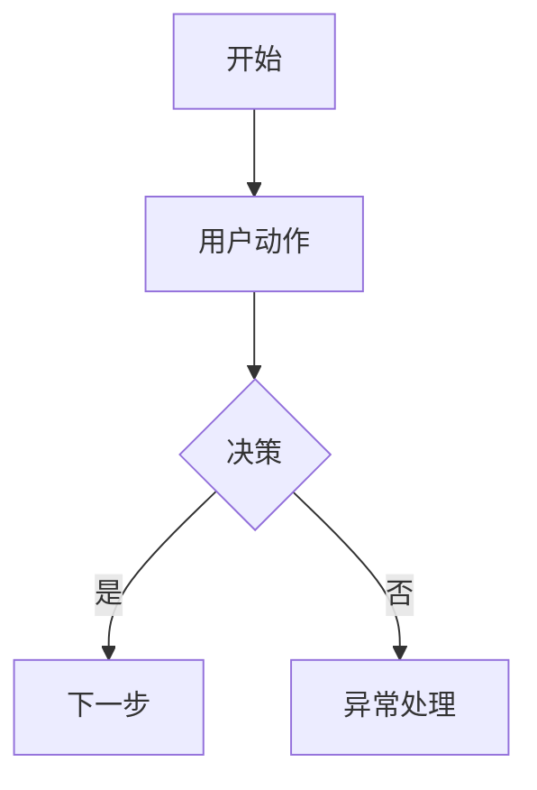

# 交付物标准

创建 Markdown 源文件、HTML 原型、PRD、Mermaid 流程图、开发交接文档或版本化交付目录时使用本文档。

## 交付目录结构

默认结构：

```text
pm-work/
  product-slug/
    vYYYYMMDD-iteration-slug/
      README.md
      requirements-list.md
      prd.md
      flow.md
      dev-handoff.md
      final-delivery.md
      index.html
      prototype.html
      prd.html
      flow.html
      dev-handoff.html
      final-delivery.html
      prototype/
        README.md
      notes/
        requirements.md
        stage-workers.md
      assets/
```

`README.md` 是版本管理入口。`index.html` 是演示和评审入口，必须链接到原型、PRD、已渲染流程图、开发交接、最终交付说明和多页面原型。`prototype.html` 是原型入口页；复杂原型使用 `prototype/` 下的额外页面。

Markdown 文件是迭代、评审和 diff 的事实源。HTML 文件用于阅读和演示，不能成为唯一承载重要需求的地方。正式 PRD、流程图和交接文档必须是产品级详规，不能只有标题或占位内容。详见 `production-document-standards.md`。

## Markdown 源文件标准

必须包含：

- `README.md`：交付索引、版本状态、文档地图、职责边界。
- `requirements-list.md`：需求阶段确认版需求清单，记录问题陈述、JTBD、是否值得做、优先级、风险、验收信号和 helper skill 调用记录。
- `prd.md`：正式产品需求文档。
- `flow.md`：Mermaid 源码和流程规则。
- `dev-handoff.md`：产品侧开发交接文档。
- `final-delivery.md`：最终确认版交付说明。
- `notes/requirements.md`：需求沟通笔记和决策记忆。
- `notes/stage-workers.md`：阶段 worker 调用、降级、主 PM 验收和用户确认记录。

规则：

- Markdown 与对应 HTML 内容保持一致。
- Markdown 用于版本管理、评审意见和后续迭代。
- 正式文档必须能指导实现：每个 must-have 行为都要有字段、规则、权限、状态和验收标准。
- 中间决策一旦被确认或暂定接受，要及时记录到 `notes/requirements.md`。
- 评审前使用 `待确认问题`；评审通过后使用 `后续决策项`。
- 除非用户明确改变任务，否则产品侧交接不得变成技术架构、数据库设计、正式 API 契约或排期承诺。
- 评审通过后，`prd.md`、`flow.md`、`dev-handoff.md` 中不得留下 `待补充`、空表或泛化占位行。

## README.md 标准

包含：

1. 版本名称和评审状态。
2. 文档链接。
3. 已确认范围。
4. 不在范围内的内容。
5. 职责边界。
6. 给业务、产品、设计、研发评审的下一步说明。

## 需求笔记标准

`notes/requirements.md` 用于保存可复用上下文和过程记忆：

- 原始诉求和业务背景。
- 问题定义。
- 需求 worker 调用记录和是否值得做判断。
- 方案架构、原型设计和文档交付 worker 的调用摘要。
- 当前流程。
- 外部参考扫描：来源链接、隐藏需求、对 MVP 的影响、拒绝扩大的内容。
- 范围选择：必须有、后置、不做、风险。
- 交互架构：角色入口、功能关系、菜单结构、页面职责、动作位置、状态流。
- 原型交互覆盖：必须有功能、原型页面、入口/控件、用户动作、成功反馈、状态/数据变化、异常路径、验收场景。
- 原型设计主题和全局 `ui-ux-pro-max` 补充输入。
- 原型打磨记录：`impeccable` 可用性、主动定位/安装/恢复动作、检查结果、修正内容、未采纳建议和原因。
- 业务规则和异常。
- 算法或数据参与点。
- 验收标准。
- 评审决策和变更记录。
- 后续决策项。

## HTML 原型标准

原型必须做到演示可用，并且对已确认 must-have 范围做到交互完整；它不需要达到生产级实现。

原型是开发理解交互逻辑的主载体。它必须展示用户如何进入功能、触发动作、获得反馈，以及对象如何流转状态。不得用静态一级页面、PRD 浮标或文字说明替代关键交互。

设计原型前，必须先按 `references/design-theme-selection.md` 完成设计主题 preflight 和设计方向确认表单。用户确认的主题是颜色、字体、圆角、间距、组件样式和整体视觉方向的主约束。

必须按以下顺序执行：

1. 读取 `references/interaction-architecture.md` 和 `references/prototype-interaction-standards.md`，确认角色入口、主流程、功能关系、菜单结构、页面职责、动作位置、状态流转和原型交互覆盖矩阵。
2. 读取 `references/design-theme-selection.md`。
3. 判断产品类型、用户角色、信息密度、工作流复杂度、菜单结构和品牌/参考来源。
4. 从 `assets/design-themes/` 中生成 3-5 个候选主题；中后台、控制台、CRM、运营平台、内部工具、权限/表格/表单密集系统默认把 Vben 放在第一推荐，但仍要提供替代主题。
5. 输出设计方向确认表单，并提供候选主题的 `examples.html` 样例预览路径。
6. 暂停等待用户确认主题。用户未确认前，不得进入 HTML 原型生成。
7. 读取被确认的主题文件。
8. 把主题应用到原型布局、CSS、组件和交互状态中。
9. 仅在需要时使用全局 `ui-ux-pro-max` 补充 UX、布局、图表、可访问性和响应式建议。
10. 在 `notes/requirements.md` 中记录交互架构摘要、原型交互覆盖矩阵、设计方向确认表单、候选主题、用户确认结果、产品语境、被选中的主题、样例预览路径、选择原因和补充建议。
11. 原型初稿完成后，读取 `references/impeccable-polish-gate.md`，先同步 bundled `impeccable` 到全局 skills 目录，再执行 `impeccable audit` 和 `impeccable polish`。
12. 如果全局 `impeccable` 不可用，先主动同步、安装或使用 `npx impeccable` / 项目脚本；只有解决失败并记录原因后，才允许按人工降级清单审阅。

需要补充建议时，使用：

```bash
python skills/pm/pm-workflow/scripts/sync_subskills.py --skill ui-ux-pro-max
```

同步后按全局 `ui-ux-pro-max` skill 调用。需要脚本时优先使用全局 skill 目录中的脚本；全局脚本不存在时，才回退到 bundled 副本脚本。不要用它的输出替换 `assets/design-themes/` 中已经匹配的主题。

只提取以下补充建议：

- 产品结构和信息架构建议。
- 图表或看板建议。
- 可访问性、焦点态、对比度、响应式和反模式提醒。

`impeccable` 原型打磨只处理体验质量，不改业务范围。即使需要安装或恢复工具，也不能借此改变已确认的产品范围。允许修正：

- 信息层级、布局节奏、对齐、间距和视觉噪声。
- 表格、筛选器、表单、弹窗、抽屉、按钮和状态标签的可用性。
- 空态、错误状态、加载状态、禁用态、hover、focus 和 active 状态。
- 响应式、对比度、键盘焦点、UX 文案和明显反模式。

不得通过 `impeccable` 新增未经确认的角色、字段、页面、审批流、算法能力、数据来源或后端逻辑。超出范围的建议只能写入后续决策项。

对于内部工具、看板、审核台或工作流系统，优先使用信息密度高但可读的布局，包含清晰表格、筛选器、状态标签、侧边导航、面包屑和任务导向控件。不要把运营型产品做成营销落地页，并优先按 `design-theme-selection.md` 选择 Vben。

必须具备：

- 真实感强的 mock 数据。
- 清晰主流程，并且每个已确认 must-have 功能都有可演示交互路径。
- 已确认的角色入口、菜单结构、页面职责、动作位置和状态流。
- 原型交互覆盖矩阵，没有遗漏的 must-have 功能。
- 每个 must-have 功能都有可点击入口/控件、用户动作、成功反馈、状态/数据变化、关键异常和验收说明。
- `prototype.html` 作为原型入口页；当单文件会遮蔽交互逻辑时，使用 `prototype/` 页面。
- 对演示有意义的页面状态。
- 仅在影响需求理解时展示空态、加载、错误样例。
- 用最小 JavaScript 实现本地交互。
- 不包含真实 API key、生产接口或隐藏外部依赖。
- 对常见桌面宽度有响应式适配；只有产品移动优先或用户要求时才默认做移动端。
- 已输出设计方向确认表单，并获得用户对主题候选的确认。
- 已输出交互架构草案，并获得用户对菜单/模块结构的确认，或明确记录为用户批准的暂定假设。
- 已选择 `assets/design-themes/` 中的设计主题，并体现在原型布局、组件、颜色、字体和交互状态中。
- 已完成 `impeccable` 原型打磨记录；如果工具起初不可用，已记录主动定位、安装、命令尝试或人工降级过程。

避免：

- 在 JavaScript 中实现真实业务引擎。
- 过度构建数据同步、后端模拟、鉴权或复杂状态机。
- 当用户需要内部工具、看板、审核台或工作流系统时，做成装饰性落地页。
- PRD 内容与页面实际行为脱节。
- 未检查工作流关系就把每个功能都做成独立页面。
- 把一级页面、指标卡片、PRD 浮标或文字说明当成 must-have 交互已完成。
- 当 `prototype/` 多页面更清晰时，仍把大量无关交互塞进一个超长单文件原型。
- 未确认菜单名称、页面职责和关键动作位置就开始视觉设计。
- 当一致图标或文字更清楚时，使用 emoji 作为 UI 图标。
- 使用与已选设计主题冲突的一次性视觉样式。
- 让 `ui-ux-pro-max` 覆盖已选主题的颜色、字体、圆角、间距或视觉气质。
- 因为 `impeccable` 未安装就直接跳过打磨。
- 借 `impeccable` 打磨新增未经确认的业务需求、字段、流程或页面。

## 内嵌 PRD 浮标标准

每个重要页面右下角都应有可展开的 PRD 浮标。

浮标内容：

- 页面目标。
- 用户角色。
- 关键功能。
- 字段说明。
- 业务规则。
- 交互说明。
- 异常处理。
- 算法说明；如不涉及可不写。
- 动作级验收标准。
- 待确认问题或后续决策项，取决于评审状态。

浮标文案必须具体、可实现。避免只写“优化体验”这类模糊表达，除非同时配有具体行为或指标。

## 独立 PRD 标准

生成 `prd.md` 和 `prd.html` 时，包含：

1. 执行摘要：问题、目标用户、方案、预期影响。
2. 问题证据：当前流程、痛点成本、证据、假设。
3. 用户和场景：主/次角色、JTBD、入口。
4. 战略上下文：业务目标、为什么现在做、MVP 原则。
5. 范围：必须有、后置、不做、风险待确认，并说明原因。
6. 信息架构：菜单、页面、页面职责、主操作。
7. 核心流程：正常路径、审核/确认路径、异常路径、人工兜底。
8. 功能需求：详细 FR，包含用户、目标、触发、响应、字段、权限、状态变化、异常和动作级验收。
9. 字段字典：含义、来源、必填、校验、可见/可编辑角色、所在页面。
10. 业务和状态规则：触发条件、保护条件、副作用、审计要求。
11. 算法/数据要求；如涉及：输入、输出、可解释性、置信度、覆盖、兜底。
12. 权限：角色能力矩阵。
13. 指标和埋点：主指标、次级指标、护栏指标、建议事件。
14. 非功能性产品要求：可用性、可访问性、性能感知、审计性、安全/隐私说明。
15. 用户故事和 Gherkin 验收标准。
16. 依赖、风险和缓解策略。
17. 不在范围内的内容。
18. 开放问题和后续决策项。

每个 must-have 功能都应能从 PRD 的问题/目标追溯到原型交互、功能需求、字段/规则、流程步骤和动作级验收标准。

动作级验收矩阵：

```markdown
| 页面 | 动作 | 触发控件 | 前置条件 | 成功结果 | 失败结果 | 状态变化 | 权限边界 | Gherkin 场景 |
| --- | --- | --- | --- | --- | --- | --- | --- | --- |
```

## 流程图标准

流程图必须以 Mermaid 源码写在 `flow.md`。`flow.html` 是离线渲染 viewer，不替代 Mermaid 源文件。

流程图应展示：

- 开始和结束点。
- 每一步的负责人或系统。
- 决策点。
- 异常路径。
- 人工审核或人工覆盖点。
- 数据或算法交接点。

`flow.md` 最小结构：

````markdown
# <产品> 流程图

## 1. 主流程



## 2. 状态规则

| 状态 | 负责人 | 进入条件 | 退出条件 |
|---|---|---|---|
|  |  |  |  |
````

工作流较重的产品必须包含：

- 主端到端流程，通常使用 `flowchart`。
- 角色泳道或跨角色流程，通常使用 `sequenceDiagram` 或分组 `flowchart`。
- 对象状态生命周期，优先使用 `stateDiagram-v2`。
- 异常、退回、拒绝或返工路径。
- 数据交接或算法参与图；如不涉及可标注不适用。

根据业务需要选择 Mermaid 的 `flowchart`、`sequenceDiagram`、`stateDiagram-v2` 或 `journey`。跨角色产品工作流优先用 `flowchart`，状态机优先用 `stateDiagram-v2`。

`flow.html` 必须遵守 `flow-viewer-standards.md`：默认渲染为 SVG，加载本地 vendor 资源，支持拖拽、缩放、重置、适配视图，并且源码只能通过切换项查看。

## 开发交接标准

`dev-handoff.md` 要帮助开发理解产品意图，但不接管技术设计。

包含：

1. 产品目标和 MVP 边界。
2. 角色与权限矩阵。
3. 页面动作矩阵：触发控件、前置条件、成功反馈、失败反馈、状态变化、权限边界、关联原型和验收场景。
4. 需求视角的核心实体。
5. 字段规则和校验摘要。
6. 业务规则和状态规则。
7. 错误、空态、加载中、禁用、无权限和冲突状态。
8. 指标和事件埋点建议。
9. 用户故事和 Gherkin 验收清单。
10. QA 场景和演示脚本。
11. 依赖、风险和后续决策项。

避免：

- 正式数据库结构。
- 最终 API 契约。
- 技术栈决策。
- 架构图。
- Sprint 计划或日期承诺。

## 最终交付标准

`final-delivery.md` 在评审通过后创建。

包含：

1. 评审状态。
2. 已确认范围。
3. 已交付文档和原型链接。
4. 不在范围内的内容。
5. 后续决策项。
6. 交接说明。
7. 停止线：本交付停在已确认产品需求，除非用户明确要求进入技术实现。

## 验收标准写法

验收标准必须是可测试语句：

```text
假如 <初始条件>
当 <用户/系统动作>
那么 <可观察结果>
```

紧凑 PRD 浮标中可以用 bullet 形式，但每条都必须有清晰可观察结果。

每个关键动作必须回答：

- 动作在哪里？
- 谁可以触发？
- 需要满足哪些前置条件？
- 成功后出现什么可见反馈？
- 失败后出现什么可见反馈？
- 哪个对象状态、负责人、数量、队列或字段会变化？
- 哪个 Gherkin 场景证明动作已完成？
