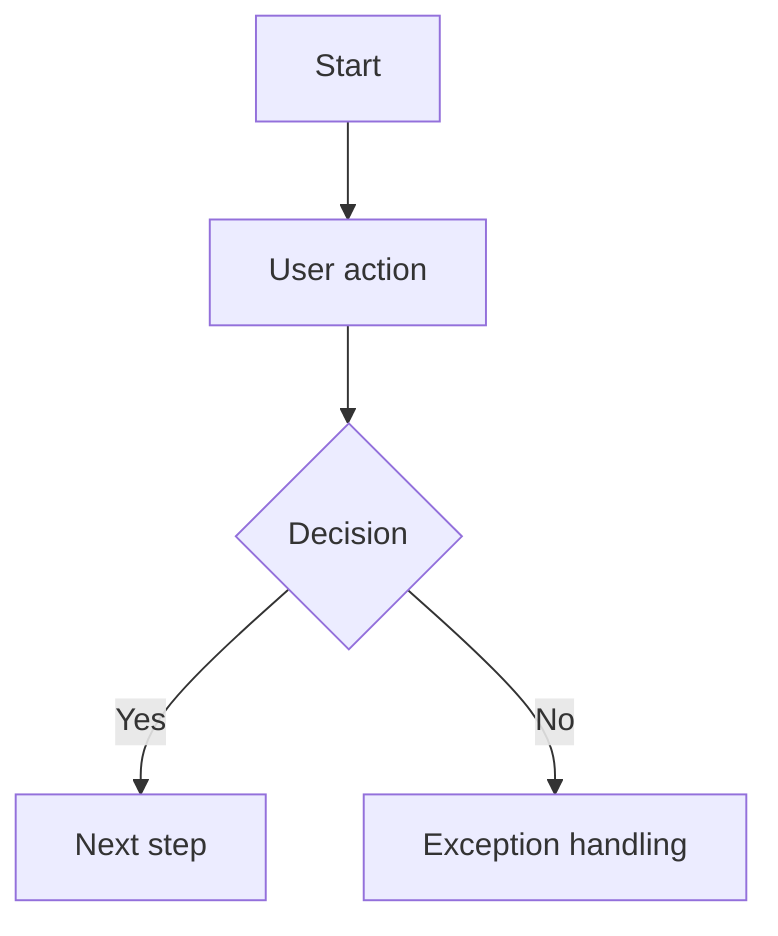

# Artifact Standards

Use this reference when creating Markdown source documents, HTML prototypes, PRDs, Mermaid flow diagrams, handoff documents, or delivery folders.

## Deliverable Structure

Default structure:

```text
pm-work/
  product-slug/
    vYYYYMMDD-iteration-slug/
      README.md
      prd.md
      flow.md
      dev-handoff.md
      final-delivery.md
      index.html
      prototype.html
      prd.html
      flow.html
      dev-handoff.html
      final-delivery.html
      notes/
        requirements.md
      assets/
```

`README.md` is the version-control entry point. `index.html` is the demo/review entry point. It should link to the prototype, PRD, flow diagrams, handoff documents, final delivery note, and any multi-page screens.

Markdown files are the source of truth for iteration, review, and diff. HTML files are readable/demo versions and must not be the only place where important requirements live.

## Markdown Source Standard

Required Markdown files:

- `README.md`: delivery index, version status, document map, responsibility boundary.
- `prd.md`: formal product requirements.
- `flow.md`: Mermaid source code and flow rules.
- `dev-handoff.md`: product-side development handoff.
- `final-delivery.md`: final confirmed delivery note.
- `notes/requirements.md`: running requirement notes and decision memory.

Rules:

- Keep Markdown and corresponding HTML consistent.
- Use Markdown for version management, review comments, and future iteration.
- Record intermediate decisions in `notes/requirements.md` as soon as they become confirmed or temporarily accepted.
- Use "后续决策项" after review passes; use "待确认问题" only before review or when a question blocks scope confirmation.
- Do not turn product-side handoff into technical architecture, database design, formal API contracts, or delivery schedule commitments unless the user explicitly changes the task.

## README.md Standard

Include:

1. Version name and review status
2. Document links
3. Confirmed scope
4. Out of scope
5. Responsibility boundary
6. Next-step notes for business/product/development review

## Requirements Notes Standard

`notes/requirements.md` stores reusable context and memory:

- Original user request and business background
- Problem definition
- Current workflow
- External reference scan: source links, hidden needs, MVP impact, rejected expansion
- Scope choices: must have / later / out of scope / risk
- Interaction architecture: role entry, function relationships, menu structure, page responsibility, action placement, status flow
- 原型设计主题和 `ui-ux-pro-max` 补充输入
- 原型打磨记录：`impeccable` 可用性、主动定位/安装/恢复动作、检查结果、修正内容、未采纳建议和原因
- Business rules and exceptions
- Algorithm or data participation point
- Acceptance criteria
- Review decisions and change log
- Follow-up decision items

## HTML Prototype Standard

The prototype should be demo-ready, not production-grade.

设计原型前，必须先按 `references/design-theme-selection.md` 完成设计主题 preflight 和设计方向确认表单。被用户确认的主题是颜色、字体、圆角、间距、组件样式和整体视觉方向的主来源。

必须按以下顺序执行：

1. 读取 `references/interaction-architecture.md`，确认角色入口、主流程、功能关系、菜单结构、页面职责、动作位置和状态流转。
2. 读取 `references/design-theme-selection.md`。
3. 判断产品类型、用户角色、信息密度、工作流复杂度、菜单结构和品牌/参考来源。
4. 从 `assets/design-themes/` 中生成 3-5 个候选主题；中后台、控制台、CRM、运营平台、内部工具、权限/表格/表单密集系统默认把 Vben 放在第一推荐，但仍要提供替代主题。
5. 输出设计方向确认表单，并提供候选主题的 `examples.html` 样例预览路径。
6. 暂停等待用户确认主题。用户未确认前，不得进入 HTML 原型生成。
7. 读取被确认的主题文件。
8. 把主题应用到原型布局、CSS、组件和交互状态中。
9. 仅在需要时使用 `ui-ux-pro-max` 补充 UX、布局、图表、可访问性和响应式建议。
10. 在 `notes/requirements.md` 中记录交互架构摘要、设计方向确认表单、候选主题、用户确认结果、产品语境、被选中的主题、样例预览路径、选择原因和补充建议。
11. 原型初稿完成后，读取 `references/impeccable-polish-gate.md`，使用 `impeccable` 做可用性、视觉层级、响应式、可访问性和交互状态打磨。
12. 如果 `impeccable` 不可用，先主动定位本地 skill、尝试安装或使用 `npx impeccable` / 项目脚本；只有解决失败并记录原因后，才允许按人工 fallback checklist 审阅。

需要补充建议时，使用：

```bash
python skills/uiux/ui-ux-pro-max/scripts/search.py "<product type> <industry> <style keywords>" --design-system -p "<Project Name>" -f markdown
```

如果当前环境中的 `ui-ux-pro-max` 路径不同，使用当前可用路径。不要用它的输出替换 `assets/design-themes/` 中已经匹配的主题。

只提取补充建议：

- 产品结构和信息架构建议
- 图表或看板建议
- 可访问性、焦点态、对比度、响应式和反模式提醒

`impeccable` 原型打磨只处理体验质量，不改业务范围。即使需要安装或恢复工具，也不能借此改变已确认的产品范围。允许修正：

- 信息层级、布局节奏、对齐、间距和视觉噪声。
- 表格、筛选器、表单、弹窗、抽屉、按钮和状态标签的可用性。
- 空状态、错误状态、加载状态、禁用态、hover、focus 和 active 状态。
- 响应式、对比度、键盘焦点、UX 文案和明显反模式。

不得通过 `impeccable` 新增未经确认的角色、字段、页面、审批流、算法能力、数据来源或后端逻辑。超出范围的建议只能写入后续决策项。

对于内部工具、看板、审核台或工作流系统，优先使用信息密度高但可读的布局，包含清晰表格、筛选器、状态标签、侧边导航、面包屑和任务导向控件。不要把运营型产品做成营销落地页，并优先按 `design-theme-selection.md` 选择 Vben。

Must have:

- Realistic mock data.
- A clear primary workflow.
- Confirmed role entry, menu structure, page responsibilities, action placement, and status flow.
- Page states that matter for the demo.
- Empty/loading/error examples only when they influence requirement understanding.
- Local interactions implemented with minimal JavaScript.
- No real API keys, no production endpoints, no hidden external dependencies.
- Responsive layout for common desktop widths; mobile only if the product is mobile-first or requested.
- 已输出设计方向确认表单，并获得用户对主题候选的确认。
- 已输出交互架构草案，并获得用户对菜单/模块结构的确认，或明确记录为用户批准的暂定假设。
- 已选择 `assets/design-themes/` 中的设计主题，并体现在原型布局、组件、颜色、字体和交互状态中。
- 已完成 `impeccable` 原型打磨记录；如果工具起初不可用，已记录主动定位、安装、命令尝试或人工降级过程。

Avoid:

- Implementing real business engines in JavaScript.
- Overbuilding data synchronization, backend simulation, auth, or complex state machines.
- Decorative landing-page sections when the user needs an internal tool, dashboard, review console, or workflow system.
- PRD content that drifts away from the screen it describes.
- Treating each requested function as a separate page without checking workflow relationships.
- Starting visual design before menu names, page responsibilities, and key action placement are confirmed.
- Using emoji as UI icons when a consistent icon style or simple text label would be clearer.
- 与已选设计主题冲突的一次性视觉样式。
- 让 `ui-ux-pro-max` 覆盖已选主题的颜色、字体、圆角、间距或视觉气质。
- 因为 `impeccable` 未安装就直接跳过打磨。
- 借 `impeccable` 打磨新增未经确认的业务需求、字段、流程或页面。

## Embedded PRD Standard

Each important screen should have a right-bottom floating PRD panel.

Panel content:

- 页面目标
- 用户角色
- 关键功能
- 字段说明
- 业务规则
- 交互说明
- 异常处理
- 算法说明, if relevant
- 验收标准
- 待确认问题 or 后续决策项, depending on review status

Keep panel text specific and implementable. Avoid vague phrases such as "optimize experience" unless paired with a concrete behavior or metric.

## Independent PRD Standard

When generating `prd.md` and `prd.html`, include:

1. Background and goal
2. Users and scenarios
3. Scope
4. Information architecture or page list
5. Core workflows
6. Functional requirements
7. Field dictionary
8. Business rules
9. Algorithm/data requirements
10. Permissions
11. Metrics and tracking
12. Non-functional notes
13. Acceptance criteria
14. Out of scope
15. Open questions

## Flow Diagram Standard

Flow diagrams must be authored as Mermaid source in `flow.md`. HTML flow diagrams are optional display copies and must not replace the Mermaid source.

Flow diagrams should show:

- Start and end points.
- Actor or system responsible for each step.
- Decision points.
- Exception paths.
- Human review or override points.
- Data or algorithm handoff points.

Minimum `flow.md` structure:

````markdown
# <Product> Flow Diagrams

## 1. Main Workflow



## 2. Status Rules

| Status | Owner | Entry Condition | Exit Condition |
|---|---|---|---|
|  |  |  |  |
````

Use Mermaid `flowchart`, `sequenceDiagram`, `stateDiagram-v2`, or `journey` based on the business need. Prefer `flowchart` for cross-role product workflows and `stateDiagram-v2` for status machines.

## Development Handoff Standard

`dev-handoff.md` should help developers understand the product intent without taking over technical design.

Include:

1. Product goal and MVP boundary
2. Role and permission matrix
3. Page/action list
4. Core entities from a requirement perspective
5. Business rules and status rules
6. Metrics and event tracking suggestions
7. Acceptance checklist
8. Follow-up decision items

Avoid:

- Formal database schema
- Final API contracts
- Technology stack decisions
- Architecture diagrams
- Sprint plans or date commitments

## Final Delivery Standard

`final-delivery.md` is created after review passes.

Include:

1. Review status
2. Confirmed scope
3. Delivered documents and prototype links
4. Out-of-scope items
5. Follow-up decision items
6. Handoff note
7. Stop line: this delivery ends at confirmed product requirements unless the user explicitly requests technical implementation

## Acceptance Criteria Standard

Write acceptance criteria as testable statements:

```text
Given <initial condition>
When <user/system action>
Then <observable result>
```

For compact PRD panels, bullet form is acceptable if each item has a clear observable result.
